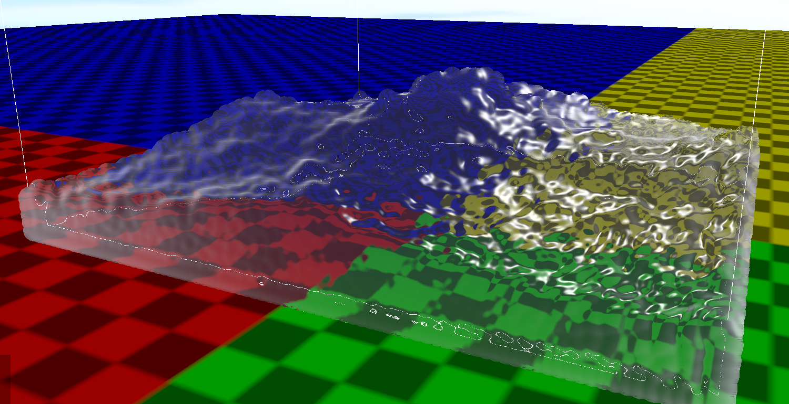
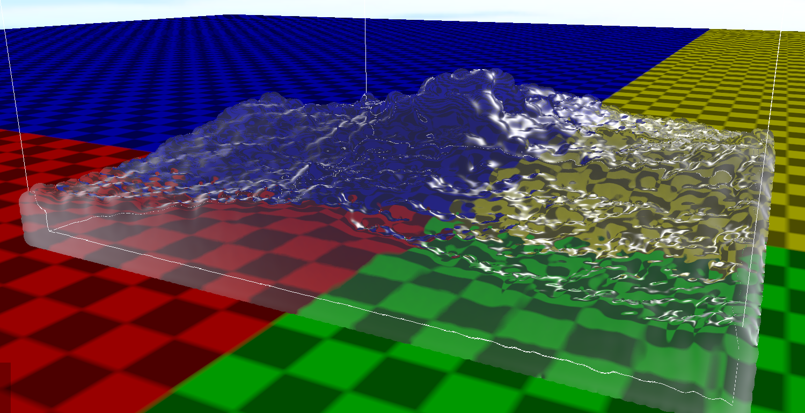
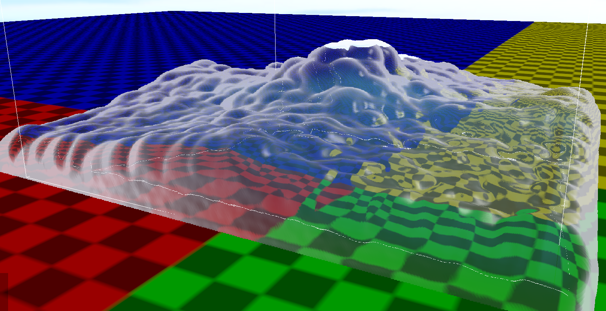

# Fluid Simulation

Trójwymiarowa aplikacja do symulacji płynów za pomocą techniki SPH oraz ich wizualizacji zrealizowana przy użyciu silnika jMonkeyEngine. Projekt oferuje interaktywne środowisko 3D umożliwiające manipulację parametrami symulacji w czasie rzeczywistym.

## Wykorzystane Technologie

* **Java 21** – Nowoczesne środowisko uruchomieniowe.
* **jMonkeyEngine** – Silnik graficzny 3D dla języka Java.
* **LWJGL 3** – Biblioteka zapewniająca niskopoziomowy dostęp do grafiki OpenGL.
* **Lemur** – Biblioteka GUI dedykowana dla silnika jMonkeyEngine.

## Wymagania systemowe

* Środowisko **JDK 21** lub nowsze.
* Karta graficzna wspierająca **OpenGL 4.3** lub nowszy wraz z aktualnymi sterownikami.

## Budowanie i Uruchomienie

Projekt wykorzystuje system budowania Maven. Konfiguracja wtyczki `maven-shade-plugin` pozwala na zbudowanie tzw. *fat JAR* (pliku zawierającego wszystkie wymagane biblioteki oraz pliki natywne dla systemów Windows i Linux).

### 1. Kompilacja i pakowanie
Aby zbudować aplikację, wykonaj w głównym katalogu projektu polecenie:
```bash
mvn clean package
```

### 2. Uruchomienie aplikacji

Po zakończeniu budowania, gotowy plik wykonywalny znajdziesz w katalogu `target/`. Uruchom go za pomocą komendy:

```bash
java -jar target/fluid-sim-1.0-SNAPSHOT.jar
```

## Obsługa i Sterowanie

Aplikacja oferuje pełną swobodę poruszania się w trójwymiarowym świecie oraz interakcję z parametrami graficznymi:

* **Poruszanie kamerą:** Przytrzymaj **LPM (Lewy Przycisk Myszy)** i poruszaj myszką, aby obracać widok.
* **Poruszanie się w przestrzeni:** Użyj klawiszy **WASD** do przemieszczania się wewnątrz sceny 3D.
* **Interfejs Użytkownika (GUI):** Panel kontrolny znajduje się w **prawym górnym rogu ekranu**. Za pomocą kursora myszy możesz rozwijać i zwijać poszczególne sekcje menu oraz manipulować suwakami i opcjami konfiguracyjnymi symulacji płynu.

## Prezentacja działania

Poniżej przedstawiono zrzuty ekranu prezentujące działanie oraz efekty wizualne generowane przez aplikację:




